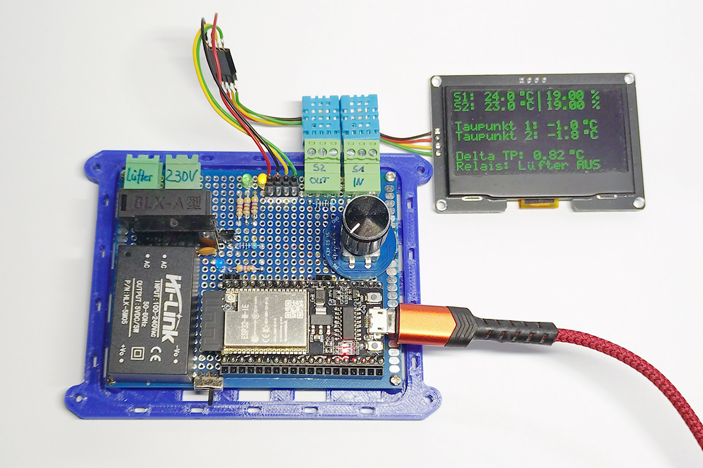
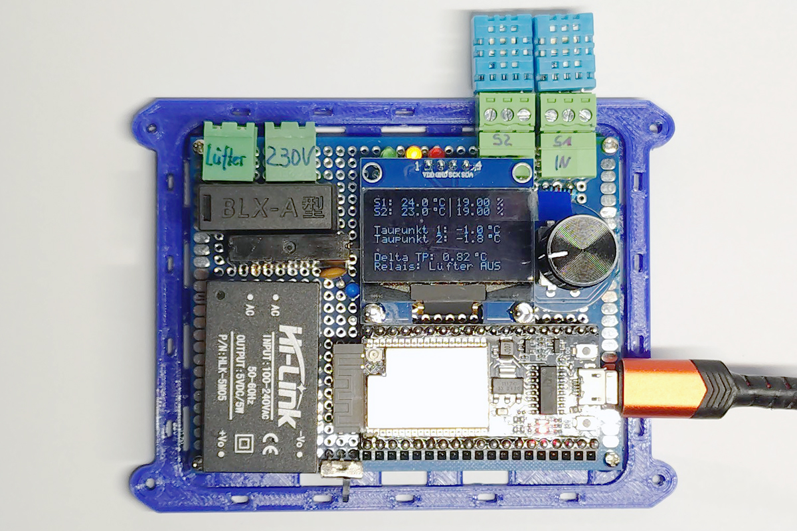
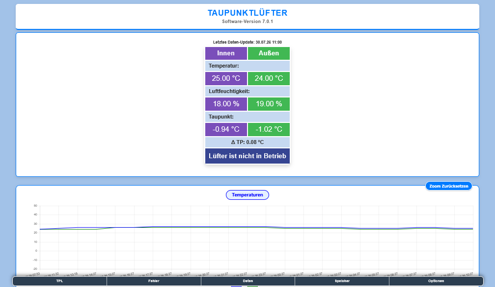
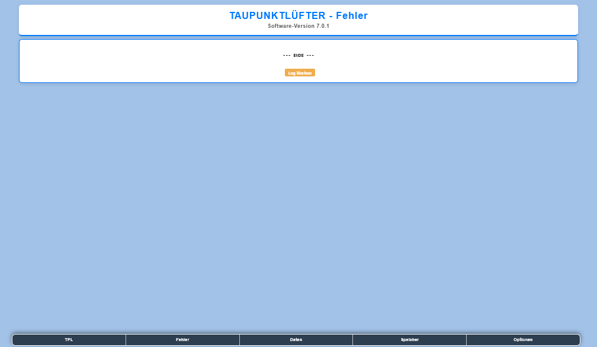
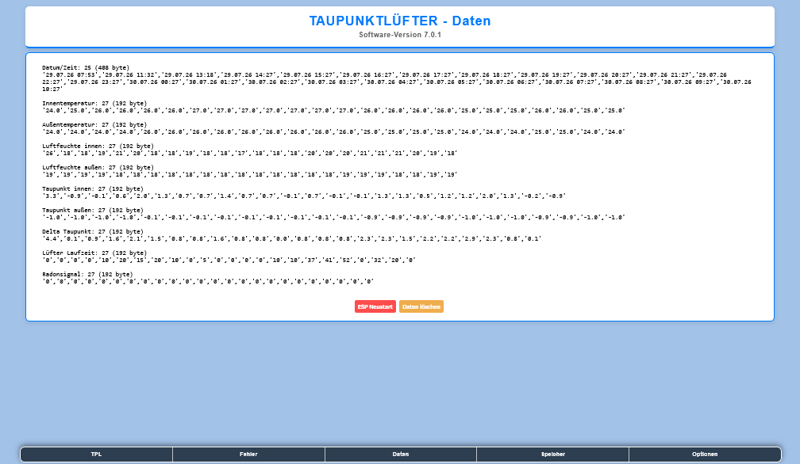
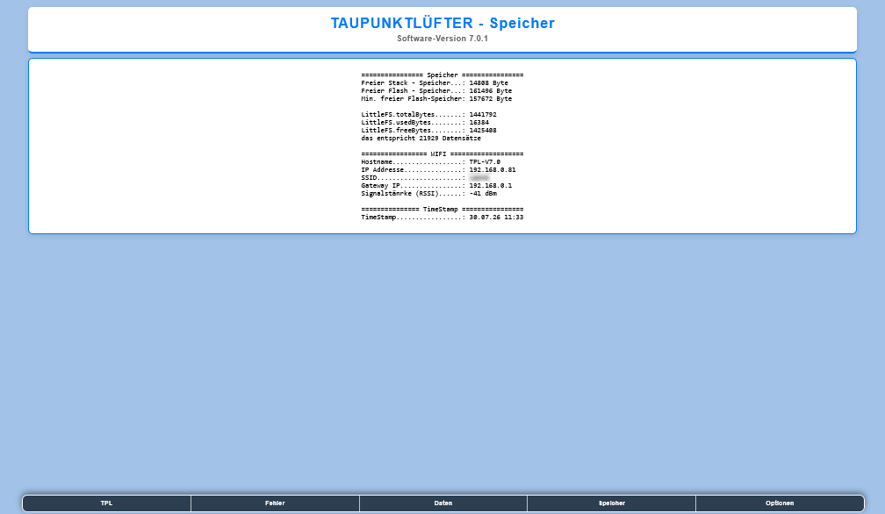
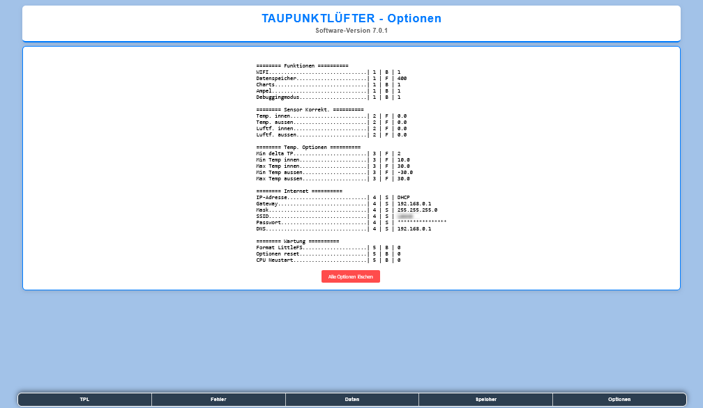
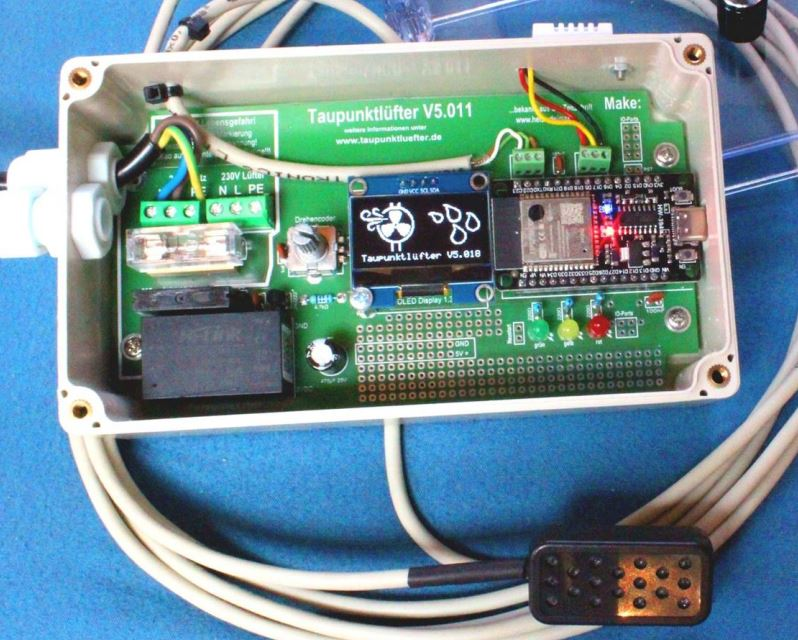

# Fork von Taupunktlüfter Bausatz

   
    

## Änderungen im Source v7.0 -> v7.0.1
- config.h hinzugefügt, es muss die config.h.example in config.h kopiert werden
- platformio.ini hinzugefügt, es kann mit vsCode genutzt werden (erheblich weniger Aufwand)
- kleinere Bugs im Code behoben
- es können auch andere Displays (I2C 0.96" / 1.3" / 2.42") genutzt werden
- der Code ist weiterhin in der ArduinoIDE kompilierbar (zum jetztigen Zeitpunkt 27.07.2026) können die Bibliotheken und Boards auf den aktuellen Stand gebracht werden
- für meinen Test habe ich DHT11 Sensoren genutzt (dies ist auch in der config.h einstellbar)
- aus diesem [Fork von djtilo-ol](https://github.com/djtilo-ol/Taupunktluefter_Bausatz/tree/patch-1) ist der Json Endpunkt übernommen
- Code neu formatiert ...

- Bei der Anzeige der Optionen im HTML WiFi Passwort maskiert
- Erhebliche Fehler im Dateihandling behoben (Files wurden im Fehlerfall nicht geschlossen und haben den weiteren Verlauf blockiert)
- massive Logikfehler beim Erstellen und Lesen der Datenfiles
    - die Dateilänge war jeweils um ein Zeichen falsch, es wurde der erste Datensatz immer gelöscht! (der erste Datensatz hat kein Komma!)
    - der erste Datensatz wurde nicht direkt gespeichert, sondern erst nach einer Stunde
    - das Ergebnis: erst nach mehr als einer Stunde wurde in den Charts überhaupt etwas angezeigt, das ist doch sehr verwirrend

- das Design aller Websites an die Startseite angepasst
- Last Save wird aus den bereits gespeicherten Daten ermittelt, so dass auch nach einem Neustart das Speicherintervall erhalten bleibt
- im Source Ordner /Firmware ist die jeweils aktuell compilierte Firmware vorhanden
    - *-Full.bin ist für einen kompletten Neu Flash gedacht

## Screenshots Website

 
 
 
 
 

## original README

Maker Media GmbH

***

# Taupunktlüfter Bausatz

 

Hier das Handbuch und der Arduino Code wenn Sie den Code ändern öder modifizieren möchten.

[Bausatz im Shop](https://shop.heise.de/make-bausatz-taupunktluefter-v5x)

